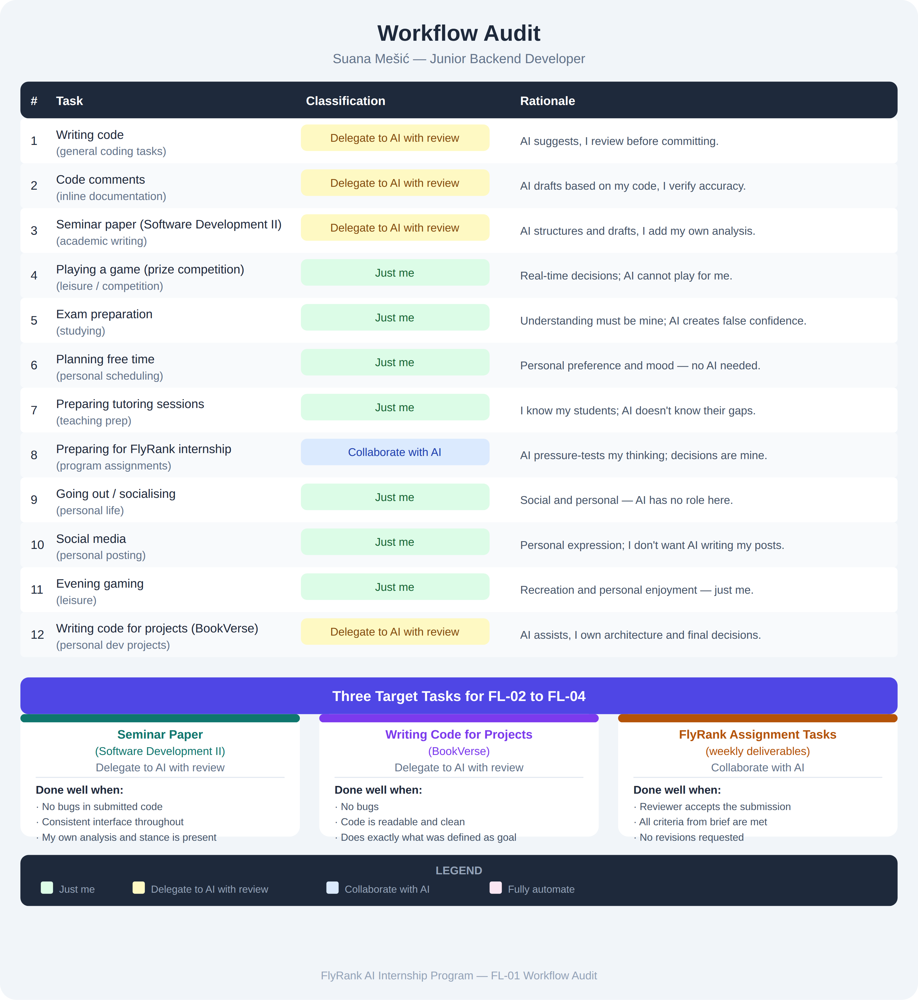

# FL-01: AI Workflow Audit and Tool Setup

**Track:** General AI Fluency
**Week:** 1 · **Phase:** Onboarding / Setup
**Intern:** Suana Mešić — Junior Backend Developer

---

## Why this matters

You can't improve a workflow you've never mapped. This audit takes 12 recurring tasks from my actual week and decides, for each one, whether AI belongs in it at all — and if so, how much leash it gets. Everything later in the track builds on this: knowing where AI helps, where it wastes my time, and where it should never be trusted.

The classification framework is from Ethan Mollick's *On-boarding your AI Intern*: **Just me · Delegate to AI with review · Collaborate with AI · Fully automate.**

---

## Workflow audit

| # | Task | Classification | Rationale |
|---|------|----------------|-----------|
| 1 | Writing code | Delegate to AI with review | AI suggests, I review before committing. |
| 2 | Code comments | Delegate to AI with review | AI drafts based on my code, I verify accuracy. |
| 3 | Seminar paper (Software Development II) | Delegate to AI with review | AI structures and drafts, I add my own analysis. |
| 4 | Playing a game (prize competition) | Just me | Real-time decisions; AI cannot play for me. |
| 5 | Exam preparation | Just me | Understanding must be mine; AI creates false confidence. |
| 6 | Planning free time | Just me | Personal preference and mood — no AI needed. |
| 7 | Preparing tutoring sessions | Just me | I know my students; AI doesn't know their gaps. |
| 8 | Preparing for FlyRank internship | Collaborate with AI | AI pressure-tests my thinking; decisions are mine. |
| 9 | Going out / socialising | Just me | Social and personal — AI has no role here. |
| 10 | Social media | Just me | Personal expression; I don't want AI writing my posts. |
| 11 | Evening gaming | Just me | Recreation and personal enjoyment — just me. |
| 12 | Writing code for projects (BookVerse) | Delegate to AI with review | AI assists, I own architecture and final decisions. |

**Split:** 7 *Just me* · 4 *Delegate to AI with review* · 1 *Collaborate with AI* · 0 *Fully automate*.

**On "Fully automate" — nothing landed here on purpose.** At this stage I don't have a task that's both repetitive enough and low-stakes enough that I'd let it run unattended. The moment I'd trust a task fully is the moment I've stopped reviewing it, and none of my current work qualifies — code gets committed, papers get submitted, students get taught. I'd rather name that honestly than invent a task to fill the box.

---

## Three target tasks (reused in FL-02 → FL-04)

Success is defined so I can tell pass from fail without arguing with myself later.

### 1. Seminar paper — Software Development II
*Delegate to AI with review*
**Done well when:** every code sample compiles and runs with 0 errors, the same interface and terminology are used from the first page to the last, and at least one section is my own analysis and stance that AI did not write.

### 2. Project code — BookVerse
*Delegate to AI with review*
**Done well when:** the feature does exactly what was defined as the goal, the build passes with 0 warnings I didn't consciously accept, and a re-read the next day needs no "wait, what was this supposed to do" — it's readable and clean.

### 3. FlyRank assignment tasks (weekly deliverables)
*Collaborate with AI*
**Done well when:** the reviewer accepts the submission on the first pass, every bullet in the brief's evaluation criteria is met, and no revision is requested.

---

## Tool setup & course — evidenced

| Requirement | Status | Evidence |
|---|---|---|
| Claude account + Project | Done | `project.png`, `project-instructions.png` |
| ChatGPT account | Done | `chatgpt-account.png` — signed in as *suana* |
| Anthropic Academy account | Done | course access, screenshot below |
| *AI Fluency: Framework & Foundations* — enrolled + ≥ first module | **Completed in full** | `academy-course-completion.png` — certificate issued |

**Certificate verification:** https://verify.skilljar.com/c/ris62pnvezi9

The course covers the **4D Framework** — Delegation, Description, Discernment, Diligence — which is the same lens this audit is built on.

### Claude Project
Named **"AI Fluency – FL Track"**, with custom instructions covering the three required areas:

- **Who I am** — a CS student and junior backend developer in Bosnia and Herzegovina, completing the FlyRank AI Internship (General AI Fluency track).
- **Tone** — direct and concise, no unnecessary praise, push back when my thinking is unclear, act as a thinking partner rather than an answer machine.
- **Current goals** — build practical AI fluency via the 4D Framework, develop my developer portfolio, and land my first professional backend role.

---

## Files in this folder

- `README.md` — this file
- `workflow-audit-table.png` — the audit, visual version
- `project.png` — the configured Claude Project
- `project-instructions.png` — the Project's custom instructions
- `chatgpt-account.png` — ChatGPT account, signed in
- `academy-course-completion.png` — AI Fluency course completed, certificate uploaded
