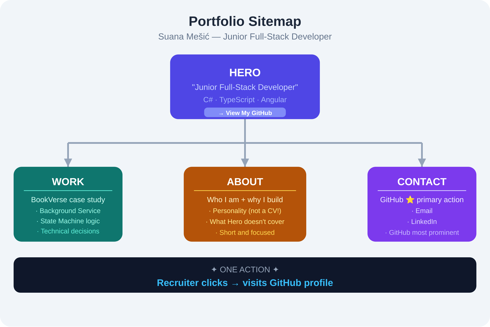
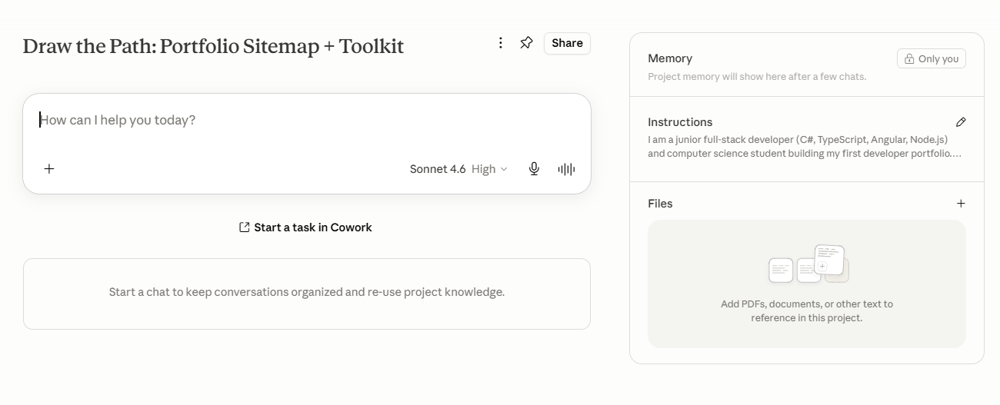
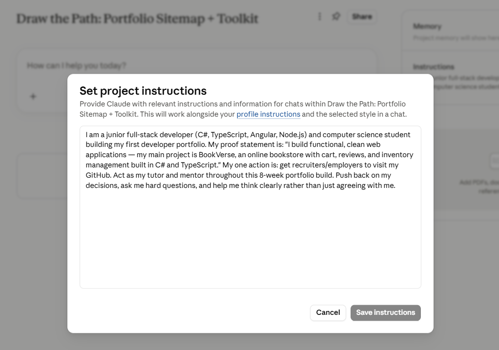
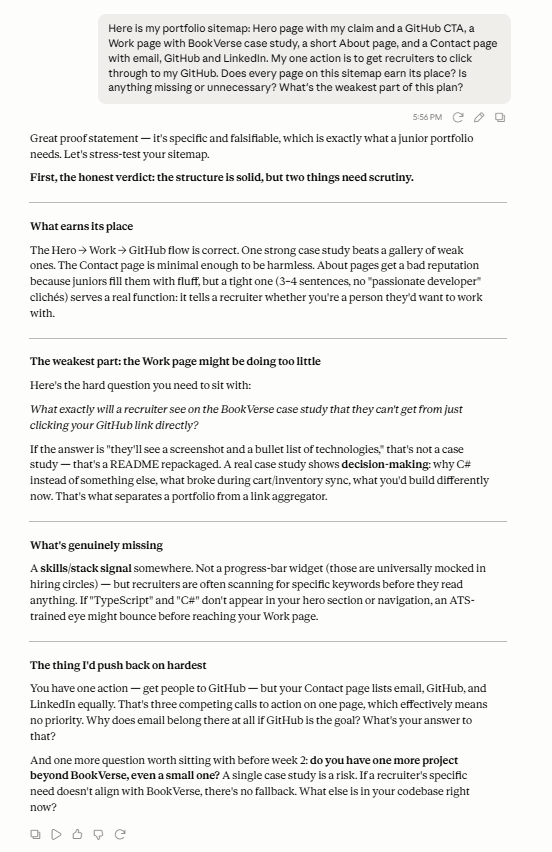

# FL-01: Draw the Path — Portfolio Sitemap + Toolkit

**Track:** General AI Fluency
**Week:** 1 | **Phase:** Setup
**Intern:** Suana Mešić — Junior Backend Developer

---

## Overview

This assignment defines the structure of my portfolio: the few pages it takes to walk one visitor from landing, to trusting me, to the single action I want them to take. Every page has to earn its place against my claim and my one action.

- **Claim:** Junior full-stack developer building functional, clean web applications in C# and TypeScript.
- **One person:** A hiring manager or technical lead at an established company.
- **One action:** Visit my GitHub.

---

## Portfolio Sitemap

The sitemap keeps to four pages — a hero that states the claim, the work that proves it, a short about, and a contact page — with GitHub as the single primary call to action.

**Structure:**
- **Hero** — claim + primary CTA (View My GitHub)
- **Work** — BookVerse case study (Background Service, State Machine, technical decisions)
- **About** — who I am and why I build; short and focused
- **Contact** — GitHub (primary), plus email and LinkedIn

---

## Toolkit & Project Setup

- **AI toolkit:** Accounts set up for the required AI assistants.
- **Dedicated project:** Created a project named "Draw the Path: Portfolio Sitemap + Toolkit" with custom instructions (my proof statement pasted in) and a request to act as a tutor and mentor for the eight-week build.

---

## Pressure Test

I ran one real prompt to pressure-test the sitemap against my claim and my one action. The full prompt and response are below.

**One thing I will change:** Add a tech stack signal (C#, TypeScript, Angular) above the fold in the Hero section, so recruiters scanning for stack compatibility see it immediately — and make GitHub the dominant call to action on the Contact page instead of giving email, GitHub, and LinkedIn equal weight.

---

## Files in This Folder

- `portfolio-sitemap.png` — the portfolio sitemap diagram
- `project.png` — screenshot of the configured project
- `project-instructions.png` — screenshot of the project's custom instructions
- `pressure-test.png` — the pressure-test prompt and response
