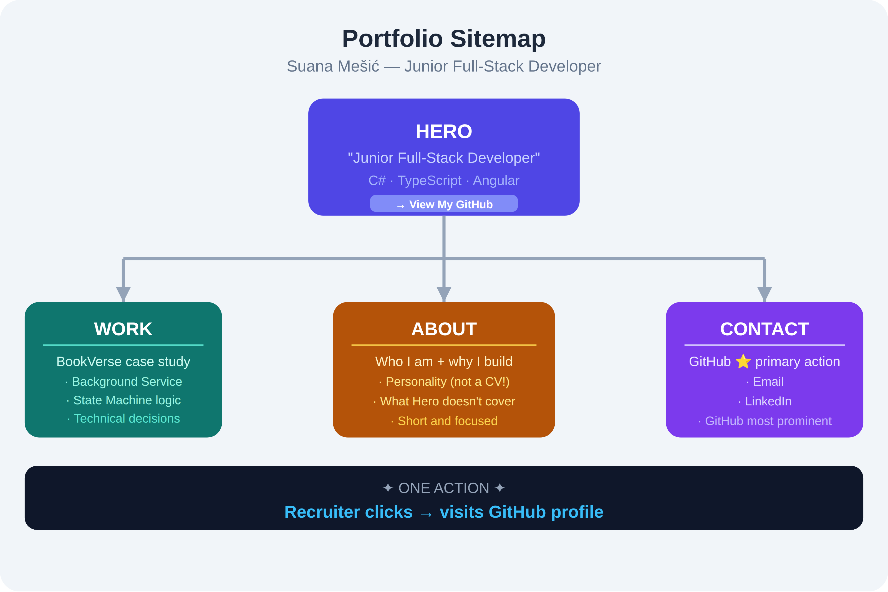
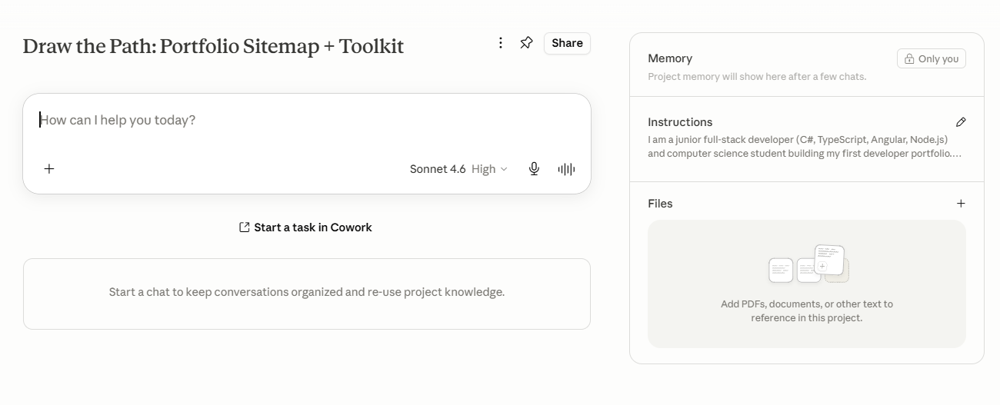
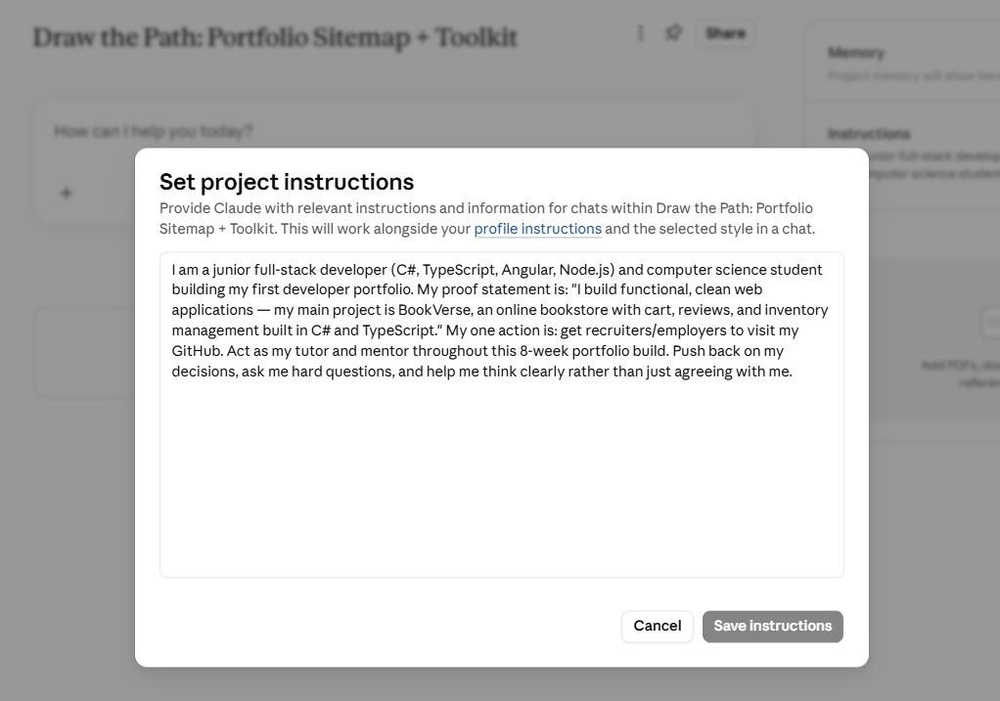
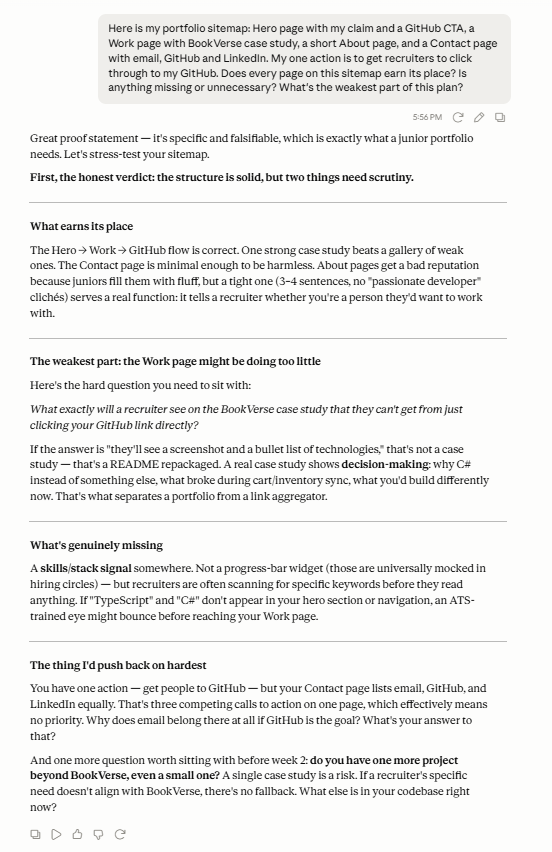

# FL-01: Draw the Path — Portfolio Sitemap + Toolkit

**Track:** General AI Fluency
**Week:** 1 · **Phase:** Setup
**Intern:** Suana Mešić — Junior Full-Stack Developer

---

## Why this matters

Once I know what I'm proving and the single action I want, the pages almost choose themselves: a place to land, the work that proves it, who I am, and how to get in touch. This assignment defines the few pages it takes to walk one visitor from landing, to trusting me, to that one action — and nothing more. Every page has to earn its place against my claim and my one action.

- **Claim:** Junior full-stack developer building functional, clean web applications in C# and TypeScript.
- **One person:** A hiring manager or technical lead at an established company.
- **One action:** Visit my GitHub.

---

## Portfolio sitemap

Four pages, one primary call to action. Nothing added "just because".

- **Hero** — states the claim, shows the stack (C# · TypeScript · Angular), and the primary CTA: *View My GitHub*.
- **Work** — the BookVerse case study: Background Service, State Machine logic, and the technical decisions behind them.
- **About** — who I am and why I build; short and focused, the part a recruiter reads to decide if I'm someone they'd want to work with.
- **Contact** — GitHub as the dominant action, with email and LinkedIn secondary.

Each page maps back to the one action — get a recruiter to click through to my GitHub profile.

---

## Toolkit — all four accounts set up

Free accounts created for the four required assistants:

| Tool | Status | Evidence |
|---|---|---|
| Claude | Signed in (Max) | `claude-account.png` |
| ChatGPT | Signed in (Free) | `chatgpt-account.png` |
| Gemini | Signed in (Pro) | `gemini-account.png` |
| Perplexity | Account created | `perplexity-account.png` |

---

## Claude Project

Named **"Draw the Path: Portfolio Sitemap + Toolkit"** — the project that follows me for all eight weeks. Custom instructions are genuine, not defaults:

- **Proof statement pasted in** — *"I build functional, clean web applications — my main project is BookVerse, an online bookstore with cart, reviews, and inventory management built in C# and TypeScript."*
- **One action** — get recruiters/employers to visit my GitHub.
- **Tutor request** — *"Act as my tutor and mentor throughout this 8-week portfolio build. Push back on my decisions, ask me hard questions, and help me think clearly rather than just agreeing with me."*

---

## Pressure test

I ran one real prompt to stress-test the sitemap against my claim and my one action. Claude pushed back hard — the full prompt and response are in `pressure-test.png`.

**What I'll change based on it:**

1. **Stack signal above the fold.** Put C#, TypeScript and Angular in the Hero (and nav), so an ATS-trained or fast-scanning recruiter sees stack compatibility before deciding whether to keep reading.
2. **One dominant CTA on Contact.** Right now email, GitHub and LinkedIn carry equal weight, which means no priority. GitHub becomes the clear primary action; email and LinkedIn drop to secondary.
3. **Address the single-project risk (noted for Week 2).** The pressure test flagged that one case study is a risk — if a recruiter's need doesn't align with BookVerse, there's no fallback. I'll plan at least one more small project, and make sure the Work page shows decision-making, not a repackaged README.

---

## Files in this folder

- `README.md` — this file
- `portfolio-sitemap.png` — the portfolio sitemap diagram
- `project.png` — the configured Claude Project
- `project-instructions.png` — the Project's custom instructions (proof statement + tutor request)
- `pressure-test.png` — the pressure-test prompt and response
- `claude-account.png` — Claude account, signed in
- `chatgpt-account.png` — ChatGPT account, signed in
- `gemini-account.png` — Gemini account, signed in
- `perplexity-account.png` — Perplexity account
