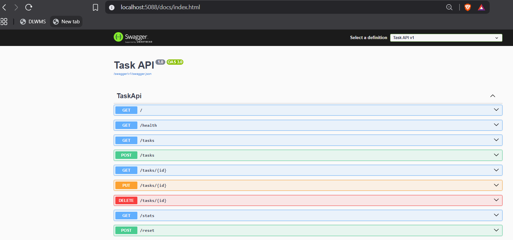
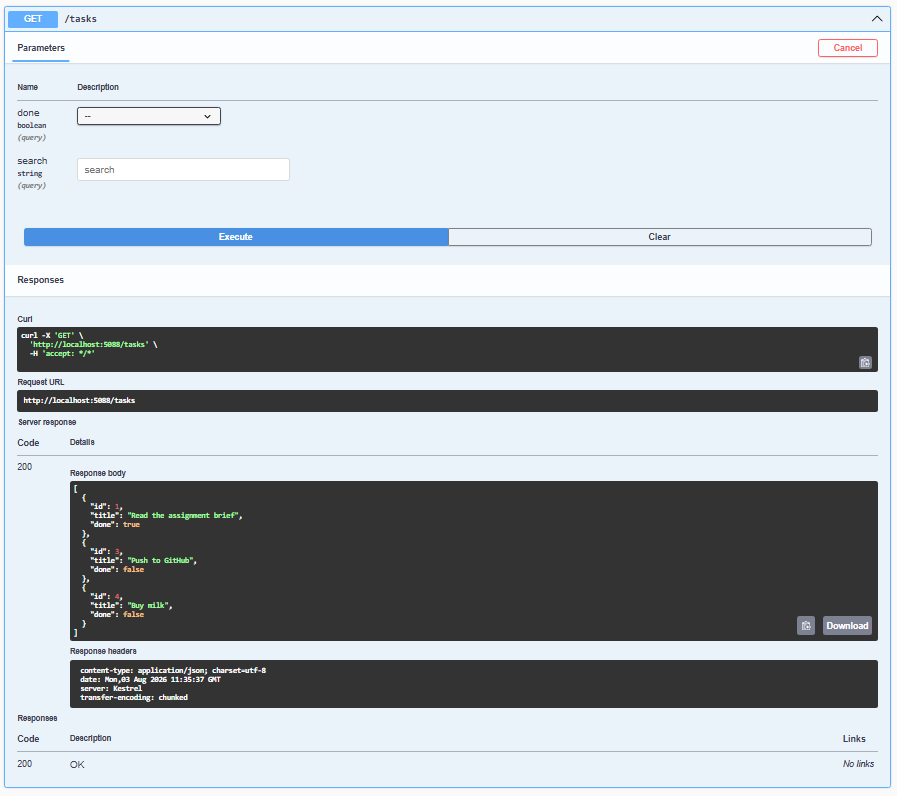

# BE-01: Build Your First CRUD API

**Track:** Backend AI Engineering | **Week:** 2 | **Phase:** Foundations
**Intern:** Suana Mešić

A small API that manages a to-do list — create, read, update, and delete tasks — with the data held only in memory and interactive docs served through Swagger UI.

> **On the technology used:** the brief offers a JavaScript (Express) and a Python (FastAPI) lane, but FlyRank explicitly allows any stack — *"there are no restrictions on tools and technologies, you can use whatever works for you"* (confirmed by FlyRank support). I built this in **C# / ASP.NET Core (Minimal API)**, the stack I use across the rest of the program. Every requirement — the five endpoints, the status codes, validation, in-memory storage, and Swagger UI — is met exactly as specified; only the language differs.

---

## What it does

The four CRUD operations mapped onto HTTP methods, over an in-memory list of tasks. Each task has an `id` (number), a `title` (text), and a `done` flag (true/false). The list is seeded with 3 tasks at startup.

Because storage is in memory, restarting the server resets everything to the 3 seed tasks — that is intentional (see *The mortality experiment* below).

---

## Run it

```bash
dotnet run --project TaskApi
```

The server starts on `http://localhost:5088` and opens Swagger UI at `http://localhost:5088/docs`.

---

## Endpoints

| Method | Route | CRUD | Success | Errors |
|---|---|---|---|---|
| GET | `/` | — | 200 (API info) | — |
| GET | `/health` | — | 200 `{ "status": "ok" }` | — |
| GET | `/tasks` | Read | 200 (list) | — |
| GET | `/tasks/{id}` | Read | 200 (one task) | 404 unknown id |
| POST | `/tasks` | Create | 201 (created task) | 400 missing/empty title |
| PUT | `/tasks/{id}` | Update | 200 (updated task) | 400 empty/invalid body · 404 unknown id |
| DELETE | `/tasks/{id}` | Delete | 204 (no body) | 404 unknown id |
| GET | `/stats` | — | 200 `{ total, done, open }` | — |
| POST | `/reset` | — | 200 (restore 3 seed tasks) | — |

Every error returns a JSON body, e.g. `{ "error": "Task 99 not found" }`.

**Optional query filters:** `GET /tasks?done=true` (only finished), `GET /tasks?search=milk` (title contains the word).

---

## Status codes

Status codes are how machines read the answer, so they are honest here: `200` reads, `201` create, `204` delete, `400` invalid body, `404` unknown id. A request for something that doesn't exist never returns an empty `200`.

---

## Validation

The server never trusts the client. `POST /tasks` rejects a missing or empty `title` with `400`. `PUT /tasks/{id}` rejects a body that changes nothing (or an empty title) with `400`, and an unknown id with `404`.

---

## Example — `curl -i`

```
> curl -i -X POST http://localhost:5088/tasks -H "Content-Type: application/json" -d "{\"title\":\"Buy milk\"}"

HTTP/1.1 201 Created
Content-Type: application/json; charset=utf-8
Date: Mon, 03 Aug 2026 11:34:31 GMT
Server: Kestrel
Location: /tasks/4
Transfer-Encoding: chunked

{"id":4,"title":"Buy milk","done":false}
```

---

## Swagger UI

The full CRUD cycle — create, list, update, delete — works from `/docs` via **Try it out**, no curl needed.

All endpoints listed at `/docs`:



"Try it out" executing `GET /tasks` and returning `200` with the task list:



---

## The mortality experiment

Create a few tasks, stop the server (`Ctrl+C`), start it again, then `GET /tasks`. The new tasks are gone and only the 3 seed tasks remain — because the list lives in memory, not on disk. This is exactly why Week 3 (a real database) exists.

---

## Files

```
Build-your-first-CRUD-API/
├─ TaskApi/
│  ├─ Models/TaskItem.cs        task entity (id, title, done)
│  ├─ Models/TaskRequests.cs    create/update request shapes
│  ├─ Store/ITaskStore.cs       interface
│  ├─ Store/InMemoryTaskStore.cs  the in-memory list + seed
│  └─ Program.cs                endpoints + Swagger wiring
├─ TaskApi.sln
└─ .gitignore
```
