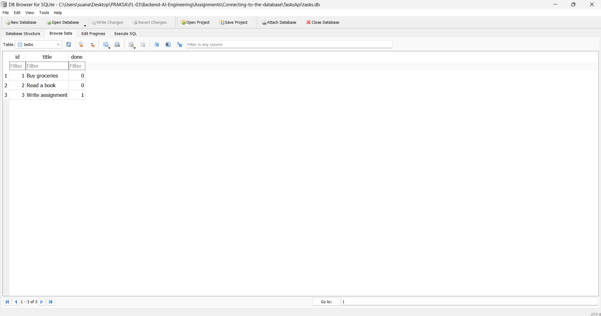

# BE-02: Connecting to the Database

**Track:** Backend AI Engineering | **Week:** 3 | **Phase:** Foundations
**Intern:** Suana Mešić

---

## What changed from Assignment 1

The API endpoints are identical — same URLs, same request bodies, same responses. The only difference is that tasks are now stored in a SQLite database file (`tasks.db`) instead of an in-memory list. Data survives server restarts.

```
Before:  Client → API → Array in memory (gone on restart)
After:   Client → API → SQLite database   (persists on disk)
```

---

## Why SQLite

SQLite stores everything in a single file. No server to install, no Docker, no connection string with passwords. The first time the app runs, it creates `tasks.db` automatically. This makes it the simplest possible step from "data in memory" to "data in a database."

The database file is stored in the project's working directory (`TasksApi/tasks.db`). It is gitignored — anyone cloning the repo gets a fresh database on first run, seeded with three example tasks.

---

## Endpoints

| Method | Route | What it does |
|---|---|---|
| GET | `/tasks` | List all tasks |
| GET | `/tasks/{id}` | Get one task |
| POST | `/tasks` | Create a task (title required) |
| PUT | `/tasks/{id}` | Update a task |
| DELETE | `/tasks/{id}` | Delete a task |

Status codes: `200` OK, `201` Created, `204` No Content, `400` missing title, `404` task not found.

---

## How to run

```bash
cd TasksApi
dotnet run
```

The database is created automatically on first run with three example tasks. No setup needed.

---

## Persistence proof

```
POST /tasks  {"title": "Novi task"}     → 201, id: 4
GET  /tasks                              → 4 tasks

Ctrl+C (stop server)
dotnet run (restart)

GET  /tasks                              → still 4 tasks ✅
```

---

## Example SQL queries

Ran these manually in DB Browser for SQLite:

```sql
-- List every task
SELECT * FROM tasks;

-- Show only completed tasks
SELECT * FROM tasks WHERE done = 1;

-- Count all tasks
SELECT COUNT(*) FROM tasks;

-- Mark every task as completed
UPDATE tasks SET done = 1;

-- Delete all completed tasks
DELETE FROM tasks WHERE done = 1;
```

After running `UPDATE tasks SET done = 1` in DB Browser, `GET /tasks` in the API immediately showed all tasks as `done: true` — the API reads from the same database file.

---

## Database screenshot



---

## Files

```
Connecting-to-the-database/
├─ TasksApi/
│  ├─ Database/DbInitializer.cs    creates table + seeds 3 tasks on first run
│  ├─ Program.cs                   all CRUD endpoints using SQL queries
│  └─ TasksApi.csproj
├─ TasksApi.sln
└─ .gitignore                      ignores tasks.db, bin/, obj/
```
