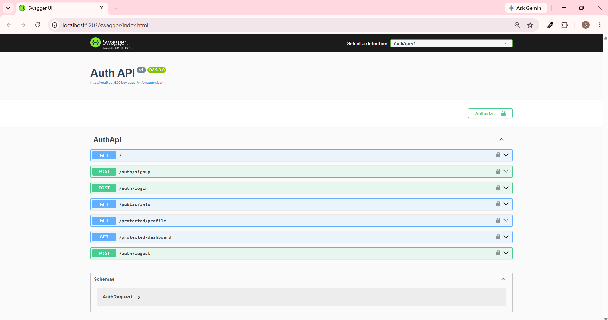

# BE-03: Auth — Login & Protect

**Track:** Backend AI Engineering | **Week:** 4 | **Phase:** Build
**Intern:** Suana Mešić

---

## What it does

A secure API that handles user authentication using Supabase Auth as the identity provider. Users sign up, log in, and receive a JWT. Protected endpoints verify that token before responding. The API never stores passwords or hashes anything — Supabase handles all of that.

---

## How it works

```
Client                    This API                  Supabase
  │                          │                          │
  ├── POST /auth/signup ────►│── POST /auth/v1/signup ─►│
  │                          │◄── user object ──────────│
  │◄── 201 Created ─────────│                          │
  │                          │                          │
  ├── POST /auth/login ─────►│── POST /auth/v1/token ──►│
  │                          │◄── access_token ─────────│
  │◄── 200 + JWT ───────────│                          │
  │                          │                          │
  ├── GET /protected/profile─►│── GET /auth/v1/user ────►│
  │   (Bearer token)         │◄── user data ────────────│
  │◄── 200 + user ──────────│                          │
```

The client never talks to Supabase directly. This API forwards credentials and verifies tokens on the client's behalf.

---

## Endpoints

| Method | Route | Auth required | Status codes |
|---|---|---|---|
| POST | `/auth/signup` | No | 201, 400 |
| POST | `/auth/login` | No | 200, 400, 401 |
| POST | `/auth/logout` | Yes | 204, 401 |
| GET | `/public/info` | No | 200 |
| GET | `/protected/profile` | Yes | 200, 401 |
| GET | `/protected/dashboard` | Yes | 200, 401 |

Status code meanings: 200 OK, 201 Created, 204 No Content, 400 missing email/password, 401 missing/invalid/expired token.

---

## Setup

1. Create a free Supabase project at [supabase.com](https://supabase.com).
2. In Supabase Dashboard → Authentication → Sign In / Providers → Email → turn off "Confirm email".
3. Go to Settings → API and copy your Project URL and anon key.
4. Clone this repo and create a `.env` file:

```
SUPABASE_URL=your_project_url
SUPABASE_KEY=your_anon_key
```

5. Run:

```bash
cd AuthApi
dotnet run
```

---

## Test it

```bash
# Signup
curl -i -X POST http://localhost:5203/auth/signup \
  -H "Content-Type: application/json" \
  -d '{"email":"test@example.com","password":"password123"}'
# → 201

# Login
curl -i -X POST http://localhost:5203/auth/login \
  -H "Content-Type: application/json" \
  -d '{"email":"test@example.com","password":"password123"}'
# → 200 + access_token

# Public (no token needed)
curl -i http://localhost:5203/public/info
# → 200

# Protected (with token)
curl -i http://localhost:5203/protected/profile \
  -H "Authorization: Bearer <paste_token>"
# → 200

# Protected (without token)
curl -i http://localhost:5203/protected/profile
# → 401

# Protected (tampered token — change one character)
curl -i http://localhost:5203/protected/profile \
  -H "Authorization: Bearer <tampered_token>"
# → 401

# Logout
curl -i -X POST http://localhost:5203/auth/logout \
  -H "Authorization: Bearer <paste_token>"
# → 204
```

---

## Swagger UI

Available at `http://localhost:5203/swagger` with Bearer token authorization.

1. Call `POST /auth/login` → copy the `access_token` from the response.
2. Click **Authorize** → paste the token → click **Authorize**.
3. All protected endpoints now work from the browser.



---

## Auth middleware

The token verification logic is extracted into a single `VerifyToken` function, reused by both `/protected/profile` and `/protected/dashboard`. Adding a new protected route means one line — no auth code is duplicated.

---

## Files

```
Auth-Login-and-Protect/
├─ AuthApi/
│  ├─ Services/SupabaseAuthService.cs   calls Supabase REST API
│  └─ Program.cs                        endpoints + Swagger config
├─ AuthApi.sln
├─ .env.example
├─ .gitignore
├─ swagger-ui.png
└─ README.md
```
