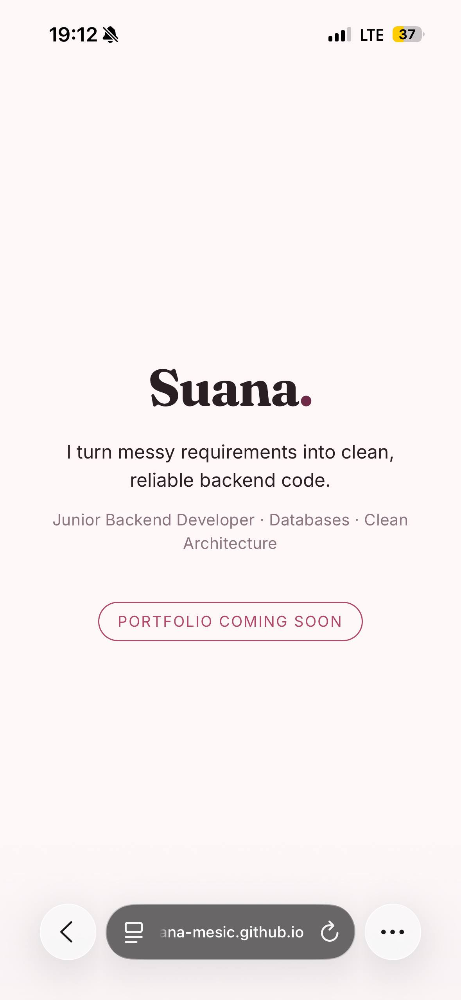

# FL-04: Pick the Stack — Three Roads + Empty but Live

**Track:** General AI Fluency | **Week:** 4 | **Phase:** Build
**Intern:** Suana Mešić — Junior Backend Developer

---

## Live URL

**https://github.com/suana-mesic/suana-mesic.github.io/tree/f1** — The version built specifically for this assignment. You can view it by cloning the repository and double-clicking index.html.

**https://suana-mesic.github.io** — The live production version, which updates depending on how many tasks I have completed.

An empty-but-live landing page: my name, my one-line claim, and a "coming soon" marker, in my identity-kit colors. Confirmed live by opening it on my phone (screenshot included), not just my laptop.

---

## The three roads I considered

I asked AI for three stack options with real trade-offs rather than one answer, giving it my constraints: free only, beginner who must be able to maintain and explain it, a single-page portfolio (Hero → Work → About → Contact), and the fact that my work is shown as **code** — a screenshot and a repo link, not image galleries or an embedded demo.

**1. No-code builder (Carrd / Framer).** Fastest to publish, drag-and-drop, no code. Trade-off: it's built for visual work (image galleries), and it isn't "mine" in a way that proves I can ship. For a backend developer whose proof is code, it hides the exact skill I want to show.

**2. Plain HTML/CSS on a free host (GitHub Pages).** Write the site myself, host it free straight from a repo. Trade-off: a few more setup steps than drag-and-drop, and I deploy with git. But it's truly mine, free forever, and the repo itself is proof I can ship.

**3. A framework (React / Next.js).** Powerful and real, but overkill for a four-section static page. Trade-off: I'd spend the build weeks fighting build errors and config instead of showing my work, and it's more to maintain than the site needs.

---

## What I chose, and why

**I chose Road 2 — plain HTML/CSS on GitHub Pages.**

- **It fits how my work is shown.** My proof is code, so a clean repo that hosts the site doubles as evidence I can ship — the site and the proof are the same artifact.
- **It matches my one action.** My whole portfolio points visitors to my GitHub; it makes sense that the site lives there too.
- **Can I maintain this?** Yes — honestly the deciding factor. I already use GitHub daily and already know `git push` from my internship deliverables repo, so deploying is something I do anyway. There's no new tool to learn and nothing that breaks silently.

I did not choose no-code because it's built for visual portfolios and hides the code skill I want to prove. I did not choose a framework because it's more machinery than a static four-section page needs, and the maintenance cost isn't justified.

**Backend needed at launch?** No — not yet. The page is static. A contact form or anything dynamic can come later if it's actually needed; most portfolios need a backend exactly once, later.

---

## Ready for the build week

Loaded into my AI workspace so next week is just filling a page that already exists:

- **Identity kit** — fonts (Fraunces + Inter), palette (burgundy `#6E2A46`, rose `#B04A67`, text `#2A2024`, background `#FDF7F8`), logo and style note.
- **Case studies** — BookVerse (the strongest), RFID attendance system.
- **Content map** — the single-page Hero → Work → About → Contact plan with the one-line claim and per-section calls to action.

---

## Proof (opened on my phone)

## Files in this folder

- `index.html` — the live empty-but-live page
- `proof-mobile-screenshot.jpg` — proof the URL is reachable on a second device (my phone)
