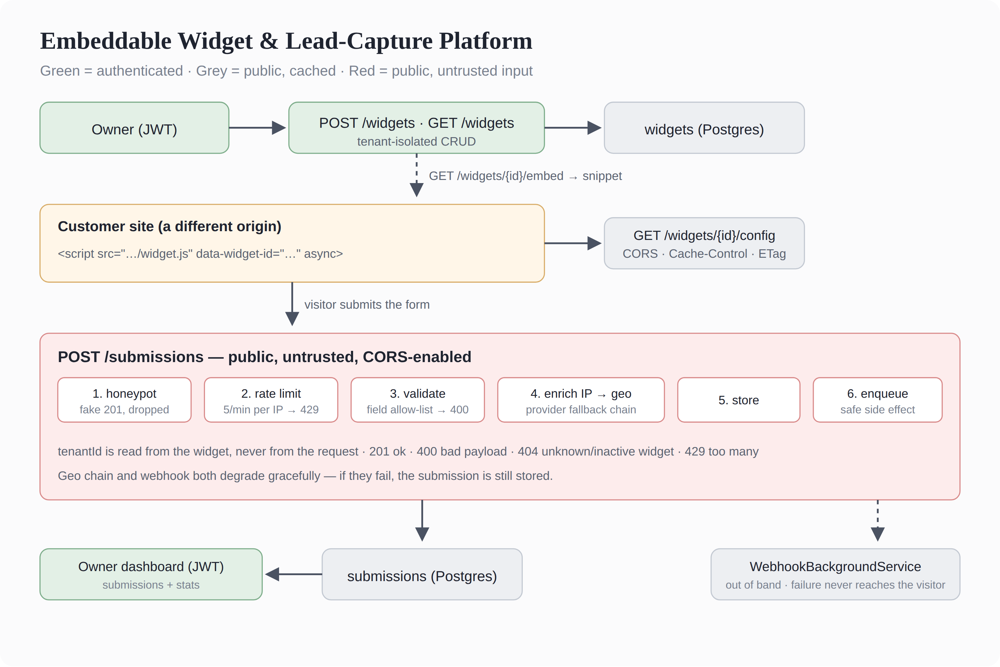

# Embeddable Widget & Lead-Capture Platform

**Capstone — Backend AI Engineering | Week 9**
**Intern:** Suana Mešić

A platform where a customer defines a widget, gets a one-line `<script>` snippet, drops it on any website they control, and has submissions flow back here — validated, rate-limited, spam-filtered, enriched with geo, and dashboarded.

The interesting part isn't the form. It's that two of these endpoints are called by browsers on sites I don't control, so they have to survive whatever arrives.

---

## Architecture



---

## Run it

```bash
cp .env.example .env          # then fill in your own values
docker compose up -d          # Postgres on host port 5433
dotnet run --project WidgetPlatform
```

The app creates its tables at startup (`Database/init.sql`, run by `DatabaseInitializer`).

**Honest note:** only Postgres runs in Docker; the API runs with `dotnet run`. The assignment didn't ask for the app to be containerized, so I didn't add that complexity.

Then open `customer-site/index.html` directly from disk — it loads as `file://`, which is a genuinely different origin from `localhost:5133`. The widget renders and submits across that boundary.

---

## Endpoints

**Authenticated (JWT)**

| Method | Route | |
|---|---|---|
| POST | `/auth/register` · `/auth/login` | returns a token |
| GET POST PUT DELETE | `/widgets` · `/widgets/{id}` | tenant-isolated CRUD |
| GET | `/widgets/{id}/embed` | the snippet to paste |
| GET | `/dashboard/submissions` | paged, optional `widgetId` filter |
| GET | `/dashboard/stats` | total, last 7 days, by widget, by country |

**Public (CORS)**

| Method | Route | |
|---|---|---|
| GET | `/widget.js` | the embed script |
| GET | `/widgets/{id}/config` | cached, minimal payload |
| POST | `/submissions` | the attacked surface |

**Demo only:** `POST /debug/geo-primary?up=false` and `POST /debug/webhook-switch?up=false` take a dependency down on purpose, so failure is demonstrable rather than theoretical.

---

## Definition of done

### Admin side — authenticated, tenant-isolated

`tenantId` is read from the JWT claim, never from the request body. It's a required parameter on every repository method — `GetByIdForTenantAsync(id, tenantId)`, not `GetById(id)` — so the interface itself makes it hard to forget, and every `WHERE` carries it.

Verified: a second tenant asking for the first tenant's widget by id gets **404**, and their dashboard reports `total: 0`.

### Config delivery — cached, small, cross-origin

`GET /widgets/{id}/config` returns only what the script needs to render: type, title, fields, version. No `tenantId`, no owner email, nothing the visitor couldn't already see on the page.

Two cache layers:
- `Cache-Control: public, max-age=300` — for five minutes the browser doesn't ask at all.
- `ETag: "{id}-{version}"` — after that it asks with `If-None-Match` and gets **304** with no body. Editing a widget bumps `version` in SQL (`version = version + 1`), which changes the ETag, so the change propagates.

### Public submission endpoint

CORS is scoped, not global: `RequireCors("public")` sits on `/config` and `/submissions` only. Admin routes deliberately have no CORS headers — a test asserts this, because a global policy would let any page call the dashboard.

Validation is an **allow-list**, not a blocklist: the widget defines its fields, and anything not in that list is rejected. `{"admin": "true"}` → **400 Unknown field: admin**. Values are capped at 500 characters.

Status codes are honest: `201` created, `400` malformed, `404` unknown or inactive widget, `429` rate-limited.

### Enrichment with a fallback chain

`GeoEnricher` walks `IEnumerable<IGeoProvider>` in registration order, wrapping each call in its own try/catch. First provider that answers wins; if all of them fail, it returns null and **the submission is still stored** — a visitor's email must not be lost because someone else's service is down.

Both providers are mocked, as the brief allows, so the test is deterministic. They return different cities on purpose — Sarajevo from the primary, Mostar from the secondary — so the stored city tells you which one answered without reading logs.

Verified live: primary up → Sarajevo. `POST /debug/geo-primary?up=false` → Mostar. Back up → Sarajevo.

### Abuse resistance

**Rate limiting** — ASP.NET's built-in fixed-window limiter, 5 requests per minute, partitioned by IP so one attacker can't exhaust everyone's budget. `QueueLimit = 0`: excess is refused immediately rather than queued, since a queue is memory an attacker can fill. Applied only to `/submissions`.

**Honeypot** — a hidden `website` field. A human never sees it; a bot fills every input it finds. If it's non-empty the request gets a **fake 201** and nothing is stored. Returning 400 would tell the bot it was caught, and the next version of that bot would skip the field.

Verified: a burst of 7 gives `201 201 201 201 201 429 429` — the excess is refused and the service stays up.

### Safe side effects

The webhook is not called inside the request. The submission is stored, a notification goes into a bounded `Channel`, and the request returns to the visitor. A `BackgroundService` drains the channel and does the sending out of band, with a 5-second timeout and its try/catch inside the loop, so one bad delivery doesn't stop the rest.

The channel is bounded at 1000 with `DropWrite` — under a flood, notifications are dropped rather than growing the queue until the process dies. Losing a notification is acceptable; losing the submission is not.

Verified: `POST /debug/webhook-switch?up=false` makes the receiver return 500. The log shows `Webhook returned 500`, the visitor still sees "Hvala!", and the row is in the database.

Had this been awaited inside the request, a broken customer webhook would have produced a 500 for the visitor — after the row was already written. She'd resubmit, and we'd have duplicates. The customer's mistake, the visitor's problem.

### Tests

```bash
dotnet test        # 10 tests
```

The four required cases:

| Required | Test |
|---|---|
| CORS preflight handled | `Preflight_from_any_origin_is_allowed_on_submissions` — plus `Admin_endpoints_do_not_get_cors_headers`, which is the half that matters |
| Validation rejects malformed/oversized | `Rejects_an_unknown_field`, `Rejects_an_oversized_value`, `Rejects_an_empty_payload` |
| Rate limiter triggers | `Returns_429_once_the_limit_is_exceeded` |
| Enrichment fallback when provider 1 is down | `Falls_back_to_the_second_provider_when_the_first_is_down`, `Returns_null_when_every_provider_fails` |

The validation and fallback tests need no database — the services take interfaces, so the tests hand them fakes. Only CORS and rate limiting spin up a real server, because they're middleware rather than my code.

---

## Notes on the frontend

`widget.js` escapes every value before touching `innerHTML`. The title comes from the customer, and my script renders it in *their visitors'* browsers — an unescaped `<script>` in a title would make me the delivery mechanism for XSS against people who never visited my site.

The script is wrapped in an IIFE so it declares nothing globally. It's a guest on someone else's page and shouldn't leave marks.

---

## What's mocked, and what I'd do next

- **Geo providers are mocked.** The brief allows this and the determinism is worth more than realism here. The chain itself is the deliverable; swapping in a real provider means one new `IGeoProvider`.
- **The webhook receiver is my own `/debug/webhook`.** In production `Webhook__Url` would point at the customer's server.
- **The debug switches are demo-only** and would be removed or gated before this went anywhere real.
- **Notifications are in-process.** A restart loses whatever is in the channel. A durable outbox table would fix it — the same pattern I used in BookVerse — but that's beyond this scope.

---

## Files

```
Embeddable-Widget&Lead-Capture-Platform/
├─ WidgetPlatform/
│  ├─ Models/                  Tenant · Widget · WidgetField · Submission · SubmissionStats
│  ├─ Repositories/            interfaces + Postgres implementations
│  ├─ Services/
│  │  ├─ AuthService.cs        BCrypt hashing + JWT
│  │  ├─ WidgetService.cs      validation
│  │  ├─ SubmissionService.cs  validation · enrichment · enqueue
│  │  ├─ Geo/                  IGeoProvider · two mocks · GeoEnricher (the chain)
│  │  └─ Notifications/        bounded channel + WebhookBackgroundService
│  ├─ Database/                init.sql + DatabaseInitializer
│  ├─ wwwroot/widget.js        the embed script
│  └─ Program.cs               routes · DI · CORS · rate limiter
├─ WidgetPlatform.Tests/       10 tests
├─ customer-site/index.html    the second-origin page
├─ WidgetPlatform.sln
├─ docker-compose.yml          Postgres + pgdata volume
├─ .env.example                committed; .env is gitignored
└─ architecture-diagram.png
```
