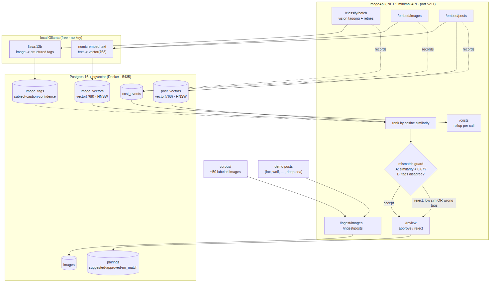

# Image Relevance & Auto-Tagging

**Capstone — Backend AI Engineering | Week 10**
**Intern:** Suana Mešić

A service that looks at a library of images, understands what's actually in each one, tags them, and matches each image to the right blog post — so the article about red foxes gets a fox photo, not a wolf, and a post with no suitable image is told so honestly.

The interesting part isn't finding the best image. It's knowing when the best image is still wrong and refusing it — because in production a wrong picture on an article is worse than no picture at all. The whole pipeline is built around that guard: ingest → classify → embed → match → **guard** → review.

---

## Architecture



---

## Run it

```bash
cp .env.example .env          # then fill in your own values
docker compose up -d          # Postgres + pgvector on host port 5435
dotnet run --project ImageApi
```

The app creates its schema at startup (`Database/init.sql`, run by `DatabaseInitializer`), including the pgvector extension and the vector indexes.

**Honest note:** only Postgres runs in Docker; the API runs with `dotnet run`. The assignment didn't ask for the app to be containerized, so I didn't add that complexity.

### Fast path (skip classification)

Classifying 50 images with a local vision model takes a while. To test
immediately, the corpus is already classified and embedded in
`seed/seed_imagedb.sql`. Restore it into the empty database **before the first
run**:

```bash
docker compose up -d
docker exec -i image-db psql -U image_user -d imagedb < seed/seed_imagedb.sql
dotnet run --project ImageApi
```

Then `/review`, `/suggest-all`, and `dotnet test` work right away. The
from-scratch path (ingest → classify → embed) is still available to regenerate
everything.

### The models run locally (and why)

Vision and embeddings both run on **local Ollama** — no API key, no quota, no per-call cost:

- **Vision:** `llava:13b` turns each image into structured tags.
- **Embeddings:** `nomic-embed-text` turns text into 768-number vectors (which is exactly the `vector(768)` width in the schema).

```bash
ollama pull llava:13b
ollama pull nomic-embed-text
```

I started on Google Gemini's free tier, but its API free tier is **not available in my region** (Bosnia) — every request came back `429 ... limit: 0` regardless of the key or project. Rather than pay during development, I moved to local Ollama: free, offline, no rate limits, and fully reproducible for whoever runs this next. The provider is a config value (`AI__VisionModel`, `AI__EmbedModel`), so swapping back to a hosted model is a one-line change.

---

## The pipeline, end to end

```
[images] ──(batch job)──► llava:13b ──► {subject, category, attributes[], caption, confidence} ──► image_tags
                                     └─► nomic-embed-text(caption) ─────────────────────────────► image_vectors
[posts] ─────────────────► nomic-embed-text(title + body) ────────────────────────────────────► post_vectors

GET /posts/:id/suggestion ─► rank by cosine similarity (pgvector) ─► mismatch guard (threshold + tags)
                          ─► { suggested | "no good match" } ─► review page: approve / reject
```

---

## Endpoints

| Method | Route                                              |                                                      |
| ------ | -------------------------------------------------- | ---------------------------------------------------- |
| POST   | `/ingest/images` · `/ingest/posts`                 | load the corpus and seed demo posts                  |
| POST   | `/classify/{id}` · `/classify/batch?limit=N`       | vision tagging (single / batch with retries)         |
| POST   | `/embed/images` · `/embed/posts`                   | embed captions and post text into pgvector           |
| GET    | `/posts/{id}/matches?limit=N`                      | raw ranked images for a post (by similarity)         |
| GET    | `/posts/{id}/suggestion`                           | best image through the guard, or "no good match"     |
| GET    | `/posts/{id}/guard/{imageId}`                      | evaluate a forced pairing (used to prove the guard)  |
| POST   | `/suggest-all` · `/posts/{id}/suggest`             | store pairing suggestions                            |
| POST   | `/pairings/{id}/approve` · `/pairings/{id}/reject` | human review actions                                 |
| GET    | `/review`                                          | one-page HTML table with thumbnails + approve/reject |
| GET    | `/costs`                                           | cost rollup per operation                            |

---

## Definition of done

### Data model

Seven tables: `images`, `image_tags`, `image_vectors`, `posts`, `post_vectors`, `pairings`, `cost_events`. The two vector tables use `vector(768)` columns with HNSW cosine indexes, so "find the nearest vectors" is an indexed operation rather than a full scan. The corpus is ~50 images across ten animal categories (five each), named `fox_01.jpg`, `wolf_03.jpg`, … so the filename prefix doubles as the ground-truth label for the eval.

### Vision tagging as validated structured output

`llava:13b` is called with Ollama's `format` set to a JSON schema, so the model must answer in exactly `{subject, category, attributes[], caption, confidence}` — not free text. The answer is deserialized into a typed `ImageTags` record. When `confidence` is below a threshold the image is **flagged** rather than trusted (`flag, don't guess`).

Verified: a valid structured payload parses into all fields with confidence in [0,1]; malformed JSON is rejected (`SchemaValidationTests`).

### Batch classification with retries + cost tracking

`POST /classify/batch` walks every `pending` image, and each call is retried up to three times before the image is marked `failed` and skipped — so one bad image never stops the run. Every vision and embedding call records a row in `cost_events` (operation, model, token counts, cost). Cost is `tokens / 1000 × rate`; the rate is 0 for the local model, so the money figure is 0, but the mechanism is real and parameterized — set `AI__CostPer1kTokens` to a hosted-model rate and the same code computes actual spend.

### Semantic matching

Captions and post text live in one 768-dimensional space. For a post, images are ranked by cosine similarity using pgvector's `<=>` operator (`similarity = 1 - distance`). Because it matches on _meaning_, a caption that never says "red fox" still surfaces for the red-fox post, and a paraphrase matches a paraphrase.

One thing worth understanding: this is text-to-text matching (post text ↔ image _caption_), because the vision model already turned each image into a sentence. So ranking reflects how alike the two descriptions are, not raw pixels — which is why, on the fox post, a richly-described arctic fox (0.81) can edge out a tersely-captioned red fox (0.79). Both are foxes and both sit well above wolves and dogs, which is what matters.

### Mismatch guard — the decision core

Two rules refuse a wrong pairing and say why:

- **Rule A (similarity):** if the best similarity is below the threshold, there is no confident match.
- **Rule B (tags):** if the image's subject doesn't match the post's topic keyword, the pairing is refused even at high similarity — the wolf-on-a-fox-post case.

The threshold (`0.67`) is calibrated to this corpus: on the real data, correct matches land at 0.69–0.81 and the one post with no suitable image (deep-sea anglerfish) tops out at 0.64, so 0.67 sits cleanly in the gap. On a different image set the threshold would be re-tuned — which is exactly why the human review step exists.

Verified live: forcing a wolf onto the fox post is refused; the deep-sea post returns "no confident match, here's why"; all five topical posts get their correct animal. And because Rule A separates the animals so well here, Rule B rarely fires on live data — so it's proven directly in a unit test (high similarity + wrong subject → tag-mismatch refusal), where it clearly belongs as the backstop for the harder case.

### Review surface

`GET /review` renders a one-page table: each post, its suggested image (thumbnail served from the corpus), the subject, similarity, status, the guard's reason, and Approve/Reject buttons that POST back and update the pairing. Posts with no confident match show "— no match —" and the reason instead of an image.

### Tests

```bash
dotnet test        # 6 tests
```

| Required                          | Test                                                                                           |
| --------------------------------- | ---------------------------------------------------------------------------------------------- |
| Schema-validation path            | `ValidVisionJson_ParsesIntoAllFields`, `MalformedJson_IsRejected`                              |
| Mismatch guard (fox rejects wolf) | `WolfOnFoxPost_HighSimilarity_RejectedByTagMismatch`, plus the accept and low-similarity cases |
| Eval — top-1 precision            | `TopOneMatch_PrecisionOnLabeledPosts_IsHigh`                                                   |

The guard and schema tests are pure (no DB). The eval test hits the real pgvector database: for each of the five labeled posts it takes the top-ranked image and checks its category against the post's animal, then asserts top-1 precision — which comes out at 100% (5/5) on this corpus.

---

## Demo

Auto-tag the folder of animal photos. Open `/review`: the red-fox post surfaces a fox, wolves/rabbits/owls/elephants each get their animal, and the deep-sea post shows "no confident match" with the reason. Force a wolf onto the fox post via `/posts/1/guard/{wolfId}` → refused. Close on `/costs` (the tracking rollup) and a green `dotnet test` with the top-1 precision number.

---

## What's simulated, and what I'd do next

- **The models are local.** `llava:13b` and `nomic-embed-text` run on Ollama for free. A hosted vision/embedding model would plug in through the same `VisionService` / `EmbeddingService` by changing the base URL and model name — the tagging, matching, guard, and cost paths around them don't change.
- **Cost is 0 because the model is free.** The rollup counts every call and its tokens; only the money is 0. Set `AI__CostPer1kTokens` to a real rate to see it compute.
- **The threshold is corpus-specific.** 0.67 fits these 50 images; a new corpus would be re-tuned. The review step is the human check that makes that safe.

Left under Stretch rather than the core: auto alt-text from tags, near-duplicate detection, a generated-image fallback when nothing matches, and human-in-the-loop QA for low-confidence pairings.

---

## Files

```
Image-Relevance-and-Auto-Tagging/
├─ ImageApi/
│  ├─ Models/                  ImageTags · VisionResult · PairingRow
│  ├─ Repositories/            Image · Tag · Vector · Match · Post · Pairing · Cost (Postgres)
│  ├─ Services/
│  │  ├─ VisionService.cs      llava:13b -> structured tags
│  │  ├─ EmbeddingService.cs   nomic-embed-text -> vector(768)
│  │  ├─ IngestService.cs      load corpus + seed posts
│  │  ├─ GuardService.cs       the mismatch guard (threshold + tags)
│  │  └─ PairingService.cs     match + guard -> stored pairing
│  ├─ Database/                init.sql + DatabaseInitializer
│  └─ Program.cs               routes · DI · static corpus · /review page
├─ ImageApi.Tests/             6 tests (schema, guard, top-1 eval)
├─ corpus/                     ~50 labeled animal images + labels.csv
├─ ImageRelevance.sln
├─ docker-compose.yml          pgvector Postgres + pgdata volume
├─ .env.example                committed; .env is gitignored
└─ architecture-diagram.png
```
