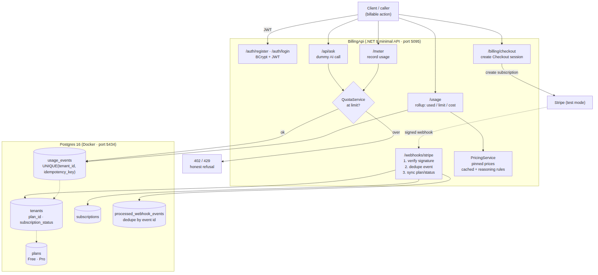

# Usage Metering & Billing Service
**Capstone — Backend AI Engineering | Week 10**
**Intern:** Suana Mešić

The service that answers one question for a SaaS product: *how much has this customer used, what does it cost, and have they hit their limit?* It meters every billable action, enforces the plan's quota at the boundary, rolls usage up into a monthly cost with the AI-token pricing rules done correctly, and integrates Stripe (test mode) for the Free → Pro upgrade.

The interesting part isn't the arithmetic. It's that two of the failure modes here cost real money: a retried request that double-counts overcharges the customer, and a forged webhook that flips someone to Pro gives away the product. So the whole thing is built around "prove it can't happen" rather than "it usually works."

---

## Architecture



---

## Run it

```bash
cp .env.example .env          # then fill in your own values
docker compose up -d          # Postgres on host port 5434
dotnet run --project BillingApi
```

The app creates its tables at startup (`Database/init.sql`, run by `DatabaseInitializer`), and seeds the two plans (Free, Pro).

**Honest note:** only Postgres runs in Docker; the API runs with `dotnet run`. The assignment didn't ask for the app to be containerized, so I didn't add that complexity.

### Stripe (test mode)

Test keys live in `.env` (loaded via `DotNetEnv`) and are read into configuration at startup. Nothing here touches real money — every key is `sk_test_` / `pk_test_`, and the card `4242 4242 4242 4242` is the only card used.

To receive webhooks locally, the Stripe CLI forwards them to the running app:

```bash
stripe listen --forward-to localhost:5095/webhooks/stripe
```

That command prints the `whsec_...` signing secret, which goes into `.env`. One wrinkle worth recording: my sandbox account sends events in API version `2026-02-25.clover`, while `Stripe.net` expects a newer one, so `EventUtility.ConstructEvent(..., throwOnApiVersionMismatch: false)` is passed on purpose. The signature is still verified — only the strict version check is relaxed.

---

## Endpoints

**Authenticated (JWT)** — `tenantId` is read from the token claim, never from the request body.

| Method | Route | |
|---|---|---|
| POST | `/auth/register` · `/auth/login` | BCrypt-hashed password, returns a JWT |
| POST | `/meter` | records a usage event idempotently, enforces the quota |
| POST | `/api/ask` | dummy AI call — spends one api_call **and** tokens |
| GET | `/usage` | this month's used / limit / cost for the tenant |
| POST | `/billing/checkout` | creates a Stripe Checkout session for the Pro upgrade |

**Stripe → server**

| Method | Route | |
|---|---|---|
| POST | `/webhooks/stripe` | signature-verified, deduplicated, syncs plan/status |

---

## Definition of done

### Data model — isolated per tenant

Five tables: `plans`, `tenants`, `usage_events`, `subscriptions`, `processed_webhook_events`. Every usage and billing row carries a `tenant_id`, and every repository read is scoped by it, so one tenant can never see or spend against another's account. The two plans are seeded from `init.sql`: **Free** (1,000 api calls + 100k tokens / month) and **Pro** (10,000 + 1,000,000).

### Idempotent metering — a retry never double-counts

The guard is a database constraint, not application luck: `UNIQUE(tenant_id, idempotency_key)` on `usage_events`, and the insert is `... ON CONFLICT DO NOTHING`. `TryRecord` returns `true` only when a row was actually written, `false` on a duplicate. So a client that retries `/meter` with the same key — because its connection dropped, not because it wants to spend twice — records **exactly one** event.

Verified: `TryRecord` called twice with the same key returns `true` then `false`, and the table holds exactly one row for that key (`UsageRepositoryTests`).

### Quota enforcement — honest status codes at the boundary

The decision lives in a pure `QuotaService.Check(...)` that both metering paths use, which is what makes it testable without a server. The rule is "at quota, the next unit is refused," and the status code tells the caller *which* limit and *why*: **429 Too Many Requests** when the api-call limit is hit, **402 Payment Required** when the token limit is hit. Both responses carry `used` and `limit` so the caller can act instead of guess.

Verified: 999/1000 + 1 is allowed (lands exactly on the limit); 1000/1000 + 1 is refused with api-call semantics; tokens over the limit are refused with token semantics (`QuotaServiceTests`).

### Cost computation — the AI-token gotchas, pinned

`PricingService` holds the prices as pinned constants and computes cost across four inputs: api calls, input tokens, cached-input tokens, and output tokens. Two rules that trip people up are baked in and locked by tests:

- **Cached input is cheaper.** A token the model has already seen (prompt caching) is billed at half the fresh-input rate — reusing a computed prefix costs less than processing it again.
- **Reasoning tokens are part of output, not a separate line.** When a model "thinks" before answering, those tokens are counted at the output rate as part of the output total — there is no third additive category. Adding one would silently overcharge.

Verified: a pinned input (100 calls, 1,000 input, 200 cached, 500 output) returns exactly `0.10465`; cached tokens cost half of the same count of fresh input; a 500-token output total is billed purely at the output rate (`PricingServiceTests`).

These rules apply to real usage too, not just the unit test: each `/api/ask` records its token split (fresh input, cached input when `reuseContext` is set, and output with reasoning folded in) into `usage_events`, and `/usage` sums those columns and prices each category — so the monthly figure reflects the cached discount and the reasoning rule.

### Stripe test-mode integration — Checkout + signed, idempotent webhooks

`POST /billing/checkout` creates a `subscription`-mode Checkout session and stamps `tenantId` into both the session metadata **and** the subscription metadata — the second one matters, because `subscription.updated` / `deleted` events hand back a `Subscription`, not the `Session`, and would otherwise have no way to know whose account they belong to.

The webhook then does three things in order, and only in this order:

1. **Verify the signature.** A payload without a valid Stripe signature throws before anything else runs. This is the line that stops a forged upgrade.
2. **Deduplicate.** The Stripe event id is inserted into `processed_webhook_events` (primary key, `ON CONFLICT DO NOTHING`); if it's already there, the event is a retry and is acknowledged with `200` without touching anything. Stripe retries on purpose, so this isn't optional.
3. **Sync.** `checkout.session.completed` moves the tenant to Pro and writes the `subscriptions` row; `subscription.updated` maps Stripe's status (`active`, `past_due`, `canceled`, …) onto the tenant; `subscription.deleted` returns them to Free.

Verified live, end to end: a real test Checkout flips the tenant to Pro (`plan_id = 2`, `subscription_status = active`, a row in `subscriptions`); a forged webhook is rejected with **400**; the same event replayed with `stripe events resend` is ignored the second time, with no duplicate in `processed_webhook_events`.

One detail the payload surfaced: because the account is in Bosnia, Stripe's adaptive pricing converted the $10.00 Pro price to ≈ 17.88 KM at Checkout. It doesn't affect the sync logic — that only reads `metadata.tenantId` and the status — but it's a real thing a reader would notice in the event data.

### Tests

```bash
dotnet test        # 10 tests
```

The five required cases:

| Required | Test |
|---|---|
| Double-count prevention | `TryRecord_WithSameIdempotencyKey_RecordsUsageOnlyOnce` |
| Limit boundary (at / over quota) | `Check_JustUnderApiCallLimit_IsAllowed`, `Check_AtApiCallLimit_IsRefusedWith429Semantics`, `Check_OverTokenLimit_IsRefusedWith402Semantics` |
| Cost formula (pinned) | `CalculateCost_WithPinnedInputs_ReturnsExactExpectedCost`, plus the two gotcha tests |
| Forged webhook rejected | `ForgedWebhook_WithInvalidSignature_IsRejected` |
| Duplicate webhook ignored | `TryMarkProcessed_WithSameEventId_IsProcessedOnlyOnce` |

The cost and quota tests need no database — those services are pure, so the tests call them directly. The metering and webhook-dedup tests hit the real test Postgres and clean up after themselves (each uses a unique key and deletes its own rows in a `finally`), so they don't pollute real data. The forged-webhook test calls the same `EventUtility.ConstructEvent` the endpoint uses, so it proves the real code path rejects it.

---

## Demo

Make `/api/ask` calls in a loop until the tenant hits its quota → the refusal is clean and honest at the boundary (429 / 402). Replay a `/meter` call with the same idempotency key → usage does not double-count. Run a Stripe test Checkout → the webhook flips the tenant to Pro. Forge a webhook → rejected. Finish on `/usage` showing used / limit / cost adding up exactly — and the pinned cost test green.

---

## What's simulated, and what I'd do next

- **The AI call in `/api/ask` is a stub.** It echoes the question and estimates token counts from word count, because the assignment explicitly allows the billable action to be a dummy endpoint. Swapping in a real model means replacing that one block with a provider call and reading the real token usage off the response — the metering, quota, and cost paths around it don't change.
- **`/meter` enforces the quota inline; `/api/ask` uses the extracted `QuotaService`.** They apply the same rule and the same status codes; the service is the version under test. Routing `/meter` through it too would be a small, safe consolidation.

Three things I left out on purpose, listed under Stretch rather than the definition of done:

- **Overage billing** — charging for usage past the quota instead of a hard block, plus a projected month-end cost.
- **Invoices** — a monthly statement with line items, rather than a single rolled-up number.
- **Proration on mid-cycle upgrade** — genuinely tricky, and out of scope for the core.

---

## Files

```
Usage-Metering-and-Billing-Service/
├─ BillingApi/
│  ├─ Models/                  AuthRequest · Tenant
│  ├─ Repositories/            Plan · Tenant · Usage · Subscription · Webhook (Postgres)
│  ├─ Services/
│  │  ├─ AuthService.cs        BCrypt hashing + JWT
│  │  ├─ PricingService.cs     pinned prices · cached-input + reasoning rules
│  │  └─ QuotaService.cs       pure quota decision (429 / 402)
│  ├─ Database/                init.sql + DatabaseInitializer
│  └─ Program.cs               routes · DI · Stripe Checkout + webhook
├─ BillingApi.Tests/           10 tests (5 required scenarios)
├─ BillingApi.sln
├─ docker-compose.yml          Postgres + pgdata volume
├─ .env.example                committed; .env is gitignored
└─ architecture-diagram.png
```
